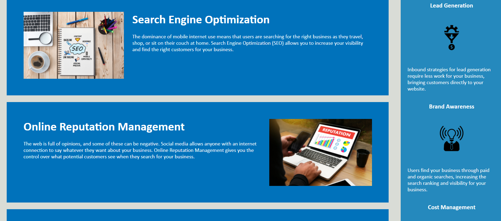

# Horiseon Digital Marketing  

## Horiseon is a website which helps define the basics of marketing. It mentions Search Engine Optimization, Online Reputation Management, and Social Media Marketing. Also, it talks on how to generate leads, brand awareness, and cost management. 

### The motivation to build this project is to help people understand the basic concepts of marketing. Through this project I learned how to minimize unnecessary code. I applied the D.P.Y (dont repeat yourself) technique and used semantic elements to optimize the website. I had a lot of fun fixing up the code and enjoyed the learning process.

Link to the GIT repository: https://github.com/mibrahim234/Challenge-1

Link to the Live Page: https://mibrahim234.github.io/Challenge-1/

## Credits: Mohammad Ibrahim